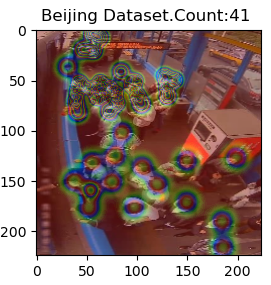

# **Density Map Method for Crowd Counting** 📊


## 🌟 **Project Overview**

This project explores the **Density Map Method** for automatic crowd counting, an approach designed to overcome limitations in traditional regression and sliding window methods. The method leverages **Convolutional Neural Networks (CNNs)** and advanced density estimation techniques to achieve accurate and scalable results.  

Key highlights:
- **Problem Domain**: Crowd analysis for security and management in dense areas.
- **Dataset**: Beijing-BRT dataset with 1,280 labeled images for training and testing.
- **Core Method**: Adaptive density maps using geometry-based Gaussian kernels.

---

## 📖 **Table of Contents**

- [Methodology](#methodology)
  - [Dataset](#dataset)
  - [Density Estimation](#density-estimation)
  - [Model Architecture](#model-architecture)
- [Installation](#installation)
- [Usage](#usage)
- [Results](#results)
- [Future Work](#future-work)
- [License](#license)
- [Acknowledgments](#acknowledgments)

---

## ⚙️ **Methodology**

### **Dataset**

- **Beijing-BRT Dataset**:  
  - 1,280 images, 16,795 labeled pedestrians.  
  - **Split**: 720 images for training and 560 for testing.  
  - Includes bounding box coordinates for each person.  
  - Augmentation: Random cropping and horizontal flipping for diversity.  

### **Density Estimation**

- **Gaussian Kernels**:  
  - Adaptive geometry-based kernels used for density mapping.  
  - Kernel size proportional to the average distance of the 4 nearest neighbors.  

- **Density Maps**:  
  - A matrix of zeros (2D array) with dimensions matching the image.  
  - Gaussian kernels applied to each labeled coordinate, summing overlapping kernels for areas of high density.

<p align="center">
  
</p>

### **Model Architecture**

- **Encoder-Decoder Neural Network**:  
  - **Encoder**: Pre-trained **VGG16** extracts features.  
  - **Decoder**: Reconstructs the density map from extracted features.  
  - Adaptive filters for multiscale information to handle varying head sizes.  

- **Loss Function**:  
  - Combination of Mean Squared Error (MSE) and Structural Similarity Index (SSIM).  
  - Total loss: `MSE + α * (1 - SSIM)` with α = 0.0025.  

<p>
  
</p>
---

## 🔧 **Installation**

1. Clone the repository:
   ```bash
   git clone https://github.com/your_username/your_repo.git
   cd your_repo
   ```

2. Install dependencies:
   ```bash
   pip install -r requirements.txt
   ```

3. Download the dataset and place it in the `data/` directory:
   - [Beijing-BRT Dataset](dataset_download_link)

---

## 🚀 **Usage**

1. Preprocess the data:
   ```bash
   python preprocess.py
   ```

2. Train the model:
   ```bash
   python train.py --epochs 3 --batch_size 16
   ```

3. Evaluate the model:
   ```bash
   python evaluate.py --dataset_path data/test/
   ```

---

## 📊 **Results**

- **Performance Metrics**:  
  - **Mean Squared Error (MSE)**: 0.60  
  - **Mean Absolute Error (MAE)**: 2.55  

- **Inference Time**:  
  - Predicts 19 images per second, constrained by hardware.  

<p>
  
</p>
---

## 🌱 **Future Work**

- Optimize the model to reduce inference time.  
- Implement alternative architectures for devices with low memory.  
- Explore additional datasets for better generalization.  

---

## 📄 **License**

Distributed under the MIT License. See `LICENSE` for more information.

---

## 🙌 **Acknowledgments**

This project was developed by:  

- Arthur Guillaume  

Inspired by works in crowd analysis and deep learning. Special thanks to the authors of [Yos+14], [Wan+15], [Zha+16], and [Din+18].

---
